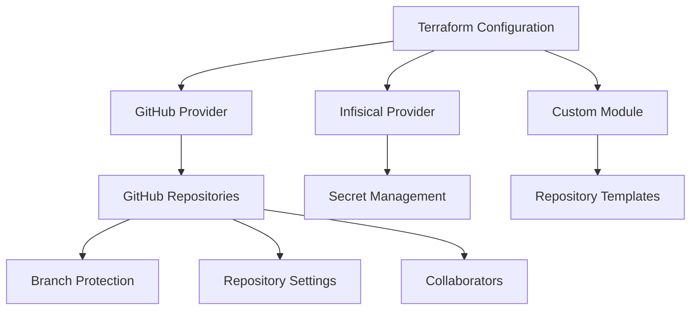

# 🚀 Terraform GitHub Management

> **Infrastructure as Code for GitHub Repository Management**

A comprehensive Terraform configuration for managing GitHub repositories at scale. This project automates the creation, configuration, and maintenance of GitHub repositories using Infrastructure as Code principles.

## 📋 Overview

This Terraform configuration provides a centralized approach to managing multiple GitHub repositories with consistent settings, security configurations, and organizational standards. It leverages the power of Terraform modules and integrates with Infisical for secure secret management.

### 🎯 Key Features

- **🏗️ Automated Repository Management**: Create and configure GitHub repositories programmatically
- **🔒 Security-First Approach**: Integrates with Infisical for secure credential management
- **📦 Modular Architecture**: Uses custom Terraform modules for reusable repository configurations
- **🔄 State Management**: Configured with remote backend for team collaboration
- **📊 Comprehensive Documentation**: Auto-generated documentation with terraform-docs

### 🛠️ Architecture



## 🚀 Quick Start

### Prerequisites

- **Terraform**: `>= 1.11.0`
- **GitHub Token**: Personal Access Token with appropriate repository permissions
- **Infisical Account**: For secure credential management

### 🔧 Setup

1. **Clone the repository**:
   ```bash
   git clone <repository-url>
   cd terraform-github
   ```

2. **Configure your environment**:
   ```bash
   # Set required environment variables
   export TF_VAR_infisical_client_id="your-client-id"
   export TF_VAR_infisical_client_secret="your-client-secret"
   export TF_VAR_infisical_project_slug="your-project-slug"
   ```

3. **Initialize Terraform**:
   ```bash
   terraform init
   ```

4. **Plan your changes**:
   ```bash
   terraform plan
   ```

5. **Apply the configuration**:
   ```bash
   terraform apply
   ```

## 📁 Project Structure

```
terraform-github/
├── backend.tf          # Remote state configuration
├── data_sources.tf     # Data source definitions
├── locals.tf           # Local value definitions
├── outputs.tf          # Output definitions
├── provider.tf         # Provider configurations
├── repos.tf            # Repository resource definitions
├── variables.tf        # Input variable definitions
└── README.md           # This file
```

## 🔐 Security Considerations

- **No Hardcoded Secrets**: All sensitive information is managed through Infisical
- **Least Privilege Access**: Repository permissions follow the principle of least privilege
- **Branch Protection**: Automatic branch protection rules for critical branches


## 📝 License

This project is licensed under the MIT License - see the [LICENSE](LICENSE) file for details.

---

<!-- BEGIN_TF_DOCS -->
## Requirements

| Name | Version |
|------|---------|
| <a name="requirement_terraform"></a> [terraform](#requirement\_terraform) | >= 1.11.0 |
| <a name="requirement_github"></a> [github](#requirement\_github) | 6.6.0 |
| <a name="requirement_infisical"></a> [infisical](#requirement\_infisical) | 0.15.17 |

## Providers

| Name | Version |
|------|---------|
| <a name="provider_infisical"></a> [infisical](#provider\_infisical) | 0.15.17 |

## Modules

| Name | Source | Version |
|------|--------|---------|
| <a name="module_github_repos"></a> [github\_repos](#module\_github\_repos) | git::https://github.com/mtopps/terraform-github-repositories.git | v0.0.1 |

## Resources

| Name | Type |
|------|------|
| [infisical_projects.main](https://registry.terraform.io/providers/Infisical/infisical/0.15.17/docs/data-sources/projects) | data source |
| [infisical_secrets.common_secrets](https://registry.terraform.io/providers/Infisical/infisical/0.15.17/docs/data-sources/secrets) | data source |

## Inputs

| Name | Description | Type | Default | Required |
|------|-------------|------|---------|:--------:|
| <a name="input_infisical_client_id"></a> [infisical\_client\_id](#input\_infisical\_client\_id) | The client ID for the Infisical API | `string` | n/a | yes |
| <a name="input_infisical_client_secret"></a> [infisical\_client\_secret](#input\_infisical\_client\_secret) | The client secret for the Infisical API | `string` | n/a | yes |
| <a name="input_infisical_project_slug"></a> [infisical\_project\_slug](#input\_infisical\_project\_slug) | The slug of the Infisical project | `string` | n/a | yes |

## Outputs

| Name | Description |
|------|-------------|
| <a name="output_repo_details"></a> [repo\_details](#output\_repo\_details) | Details of the GitHub repositories including their HTML URL and SSH clone URL. |
<!-- END_TF_DOCS -->